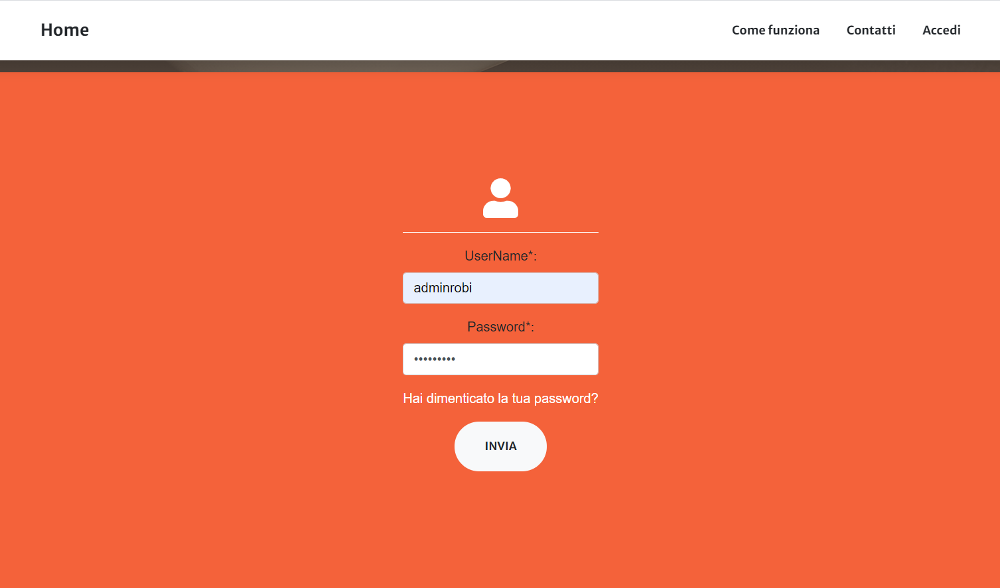

Amministratore
==================================

Il primo passo per accedere al Sistema di Istanza Online consiste nell'effettuare il login inserendo il proprio username e password indicati in fase di iscrizione al Sistema.

Qualora si fosse dimenticata la propria password, è possibile cliccare sul link **Hai dimenticato la password?** e inserendo il proprio username verrà inviata una mail automatica all'utente con un link alla pagina in cui potrà essere inserità la nuova password.

Una volta fatto l'accesso, l'utente viene reindirizzato alla propria dashboard in cui può:

* Visualizzare i propri dati
* Modificare i propri dati
* Visualizzare le istanze inviate dai Cittadini e i relativi pagamenti
* Inviare ai Cittadini informazioni relative al numero di bolli dovuti per ottenere il CDU
* Caricare il file di CDU/Visura
* Viaualizzare gli utenti iscritti al Sistema
* Monitorare la validità delle informazioni (es. data di scadenza del documento di identità) fornite dai Cittadini in fase di iscrizione
* Rendere altri utenti amministratori

La **Dashboard Amministratore** è suddivisa in tre sezioni:

* Dati utente
* Tabella istanze
* Tabella utenti

Gestione dati personali
----------------------------------

Accdendo alla propria dashboard, è possibile visualizzare le informazioni principali relative al proprio utente che sono state inserite in fase di iscrizione. Tra queste informazioni, è obbligatorio indicare il numero di un documento di identità (Carta di Identità, Passaporto, ecc.) e la relativa data di scadenza. Se il documento risulta scaduto, il Sistema mostrerà un avviso per segnalare all'utente la necessità di modificare i propri dati inserendo un documento valido. 

.. image:: img/dati_admin.png
  :align: center

E' possibile modificare i propri dati cliccando sul bottone **Modifica Dati** che reindirizza l'utente a un form da cui sarà possibile visualizzare le informazioni attualmente presenti ed eventualmente modificarle. Una volta salvate le modifiche l'utente viene reindirizzato alla propria dashboard dove può visualizzare i propri dati con le modifiche apportate.

.. warning:: Non è possibile salvare le modifiche ai propri dati finchè non viene spuntata la casella per il **consenso al trattamento dei dati peronali**. Una volta selezionata la casella, verrà attivato il bottone per il salvataggio delle modifiche.

Gestione Istanze
------------------------------

.. image:: img/istanze_admin.png
  :align: center

La tabella istanze mostra tutte le istanze inviate dagli utenti. Per ogni istanza viene visualizzato:

* Nome e Cognome dell'utente che ha inviato l'istanza
* indirizzo mail dell'utente che ha inviato l'istanza
* Tipo di Istanza (CDU o Visura). In caso di CDU richiesto per **Successione Ereditaria o Esproprio** viene visualizzato anche il motivo della richiesta per segnalare all'utente che in questi due casi non è dovuto il pgamaneto del bollo per il CDU ma sono dovuti solo i Diritti Istruttori e il Bollo per l'Istanza
* la data in cui è stata inviata l'istanza dall'utente
* il file di testo con l'elenco dei mappali selezionati dall'utente e per i quali è richiesto il CDU. Il file può essere visualizzato e scaricato per essere utilizzato come input del Plugin QGIS CDU Creator
* il file relativo al pagamento dei diritti istruttori, consultabile e scaricabile tramite link, e un pulsante per copiare gli estremi del pagamento forniti dall'utente
* il file relativo al pagamento della marca da bollo per l'istanza, consultabile e scaricabile tramite link, e un pulsante per copiare il codice identificativo di 14 cifre del bollo fornito dall'utente
* il file relativo al pagamento della marca da bollo per il CDU, consultabile e scaricabile tramite link, e un pulsante per copiare il codice identificativo di 14 cifre del bollo fornito dall'utente
* n° di bolli integrativi dovuti per ricevere il CDU. Cliccando sul bottone l'amministratore può inserire il numero di bolli che l'utente deve ancora pagare per ottenere il CDU. Una volta inserito il numero comparirà nella cella e contemporaneamente verrà inviata una mail all'utente con indicato il n° di bolli da pagare per ottenere il CDU. Il nuero di bolli può essere modificato finchè il CDU non viene inviato, se modificato il nuovo numero di bolli comparirà nella cella e verrà inviata una mail automatica all'utente per informarlo della modifica
* il file relativo al pagamento della/e marca/he da bollo integrative per il CDU, consultabile e scaricabile tramite link, e un pulsante per copiare il/i codice/i identificativo/i di 14 cifre del/i bollo/i fornito/i dall'utente. Se è stato indicato un numero di bolli integrativi, nella cella corrispondente a questa colonna comparirà la dicitura *In attesa* finchè l'utente non caricherà i dati relativi al pagamento
* il file del CDU, cliccando sul bottone l'utente amministratore può caricare il file pdf del CDU prodotto con il Plugin QGIS CDU Creator

Una volta caricato il file pdf del CDU si attiva il tasto di invio in corrispondenza dell'istanza per la quale si è caricato il file. Cliccando su invia, il file del CDU sarà reso visibile e scariabile sulla dashboard dell'utente che ne ha fatto richiesta, inoltre viene anche inviata una mail automatica all'indirizzo mail del Comune di conferma dell'invio e una mail all'utente per informarlo che il CDU è disponibile per il download. Una volta inviato il CDU non è più possibile modificare il numero di bolli e il file del CDU e inoltre il tasto di invio viene disabilitato. Le istanze per le quali si è terminato l'iter (pagamenti da parte del Cittadino e invio CDU) vengono evidenziate in verde.

Gestione Utenti
------------------------------

La tabella utenti mostra tutti gli utenti iscritti al Sistema di Istanze Online del Comune. Per ogni utente viene visualizzato:

* username dell'utente
* Nome e Cognome
* indirizzo mail dell'utente
* Codice Fiscale
* Numero del Documento di Identità
* la data di scadenza del Documento di Identità
* Indirizzo
* Numero di telefono
* Affiliazione

Per quanto riguarda la **data di scadenza del documento**, il Sistema segnala se il documento risulta scaduto. La riga corrispondente all'utente il documento è scaduto viene evidenziata in giallo e in corrispondenza della data di scadenza viene visualizzato un bottono con il quale l'utente amministratore può notificare all'utente che il documento risulta scaduto. Premendo il bottone infatti viene inviata una mail automatica all'utente che lo avvisa della problematica e lo invita a modificare quanto prima i suoi dati inserendo un documento di identità valido. Se il documento è scaduto infatti, l'utente non potrà richiedere un nuovo CDU.

La colonna **Rimuovi** mostra un pulsante con il quale l'utente amministratore può rimuovere l'utente dal Sistema. Una volta rimosso, l'utente non potrà più accedere alla sua dashboard e dovrà procedere alla creazione di un nuovo account.

La colonna **Admin** mostra un pulsante con il quale l'utente amministratore può rendere amministratore un altro utente iscritto al Sistema.
