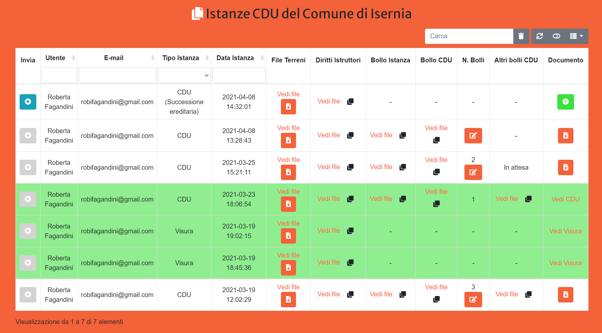

Amministratore
==================================

Il primo passo per accedere al Sistema di Istanza Online consiste nell'effettuare il login inserendo il proprio username e password indicati in fase di iscrizione al Sistema.

.. image:: img/login.png
  :align: center

Una volta fatto l'accesso, l'utente viene reindirizzato alla propria dashboard in cui può:

* Visualizzare i propri dati
* Modificare i propri dati
* Visualizzare le istanze inviate dai Cittadini e i relativi pagamenti
* Inviare ai Cittadini informazioni relative al numero di bolli dovuti per ottenere il CDU
* Caricare il file di CDU/Visura
* Viaualizzare gli utenti iscritti al Sistema
* Monitorare la validità delle informazioni (es. data di scadenza del documento di identità) fornite dai Cittadini in fase di iscrizione
* Rendere altri utenti amministratori

La **Dashboard Amministratore** è suddivisa in tre sezioni:

* Dati utente
* Tabella istanze
* Tabella utenti

Gestione dati personali
----------------------------------

Accdendo alla propria dashboard, è possibile visualizzare le informazioni principali relative al proprio utente che sono state inserite in fase di iscrizione. Tra queste informazioni, è obbligatorio indicare il numero di un documento di identità (Carta di Identità, Passaporto, ecc.) e la relativa data di scadenza. Se il documento risulta scaduto, il Sistema mostrerà un avviso per segnalare all'utente la necessità di modificare i propri dati inserendo un documento valido. 

.. image:: img/dati_admin.png
  :align: center

E' possibile modificare i propri dati cliccando sul bottone **Modifica Dati** che reindirizza l'utente a un form da cui sarà possibile visualizzare le informazioni attualmente presenti ed eventualmente modificarle. Una volta salvate le modifiche l'utente viene reindirizzato alla propria dashboard dove può visualizzare i propri dati con le modifiche apportate.

.. warning:: Non è possibile salvare le modifiche ai propri dati finchè non viene spuntata la casella per il **consenso al trattamento dei dati peronali**. Una volta selezionata la casella, verrà attivato il bottone per il salvataggio delle modifiche.

Gestione Istanze
------------------------------

La tabella istanze mostra tutte le istanze inviate dagli utenti ovvero quelle per le quali l'utente ha caricato l'autocertificazione di pagamento dei Diritti Istruttori e della marca da bollo per l'istanza stessa. Per ogni istanza viene visualizzato:

* username dell'utente che ha inviato l'istanza
* indirizzo mail dell'utente che ha inviato l'istanza
* la data in cui è stata inviata l'istanza dall'utente
* il file di testo con l'elenco dei mappali selezionati dall'utente e per i quali è richiesto il CDU. Il file può essere visualizzato e scaricato per essere utilizzato come input del Plugin QGIS CDU Creator
* l'autocertificazione del pagamento dei diritti istruttori
* l'autocertificazione del pagamento della marca da bollo per l'istanza
* n° di bolli dovuti per ricevere il CDU. Cliccando sul bottone l'amministratore può inserire il numero di bolli, una volta inserito il numero comparirà nella cella e contemporaneamente verrà inviata una mail all'utente con indicato il n° di bolli da pagare per ottenere il CDU. Il nuero di bolli può essere modificato finchè il CDU non viene inviato
* l'autocertificazione del pagamento delle marche da bollo per il CDU
* il file del CDU, cliccando sul bottone l'utente amministratore può caricare il file pdf del CDU proddotto con il Plugin QGIS CDU Creator

