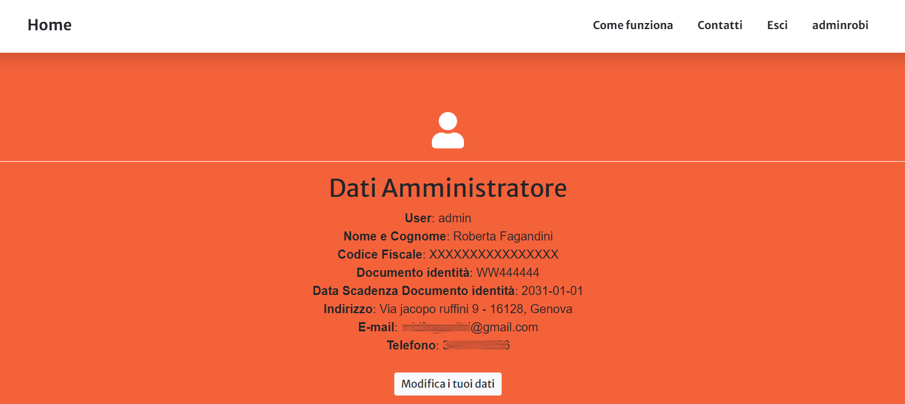

Utenti
==================

Il primo passo per accedere al Sistema di Istanza Online consiste nell'effettuare il login inserendo il proprio username e password indicati in fase di iscrizione al Sistema.

Qualora si fosse dimenticata la propria password, è possibile cliccare sul link **Hai dimenticato la password?** e inserendo il proprio username verrà inviata una mail automatica all'utente con un link alla pagina in cui potrà essere inserità la nuova password.

.. image:: img/login.png
  :align: center

Una volta fatto l'accesso, l'utente viene reindirizzato alla propria dashboard in cui può:

* Visualizzare i propri dati
* Modificare i propri dati
* Richiedere un nuovo CDU/Visura
* Gestire i pagamenti di diritti istruttori e bolli caricando le relative autocertificazioni di pagamento
* Scaricare il file di CDU/Visura

La **Dashboard Utente** è suddivisa in tre sezioni:

* Dati utente
* Richiesta CDU
* Tabella istanze

Gestione dati personali
----------------------------------

Accdendo alla propria dashboard, è possibile visualizzare le informazioni principali relative al proprio utente che sono state inserite in fase di iscrizione. Tra queste informazioni, è obbligatorio indicare il numero di un documento di identità (Carta di Identità, Passaporto, ecc.) e la relativa data di scadenza. Se il documento risulta scaduto, il Sistema mostrerà un avviso per segnalare all'utente la necessità di modificare i propri dati inserendo un documento valido. **In questo caso, finchè non viene inserito un documento di identità valido, non sarà possibile creare una nuova istanza di CDU.**

E' possibile modificare i propri dati cliccando sul bottone **Modifica Dati** che reindirizza l'utente a un form da cui sarà possibile visualizzare le informazioni attualmente presenti ed eventualmente modificarle. Una volta salvate le modifiche l'utente viene reindirizzato alla propria dashboard dove può visualizzare i propri dati con le modifiche apportate.

.. warning:: Non è possibile salvare le modifiche ai propri dati finchè non viene spuntata la casella per il **consenso al trattamento dei dati peronali**. Una volta selezionata la casella, verrà attivato il bottone per il salvataggio delle modifiche.

.. _richiesta-cdu:

Richiesta CDU
------------------------------------

Cliccando sul bottone **RICHIEDI CDU** l'utente è reindirizzato a una pagina dalla quale è possibile:

* selezionare foglio e mappale che identificano i terreni per i quali si vuole richiedere il CDU. Una volta selezionato si il foglio che il mappale è necessario cliccare sul tasto **+** per aggiungere il terreno alla lista dei mappali per cui richiedere il CDU. Cliccando sul tasto **+** i dettagli del terreno selezionato saranno visibili nella tabella. Finchè l'istanza non viene aggiunta è sempre possibile **rimuovere** un terreno selezionato cliccando sul tasto corrispondente nella colonna **Rimuovi**.

.. warning:: E' possibile richiedere il CDU per un numero massimo di 20 terreni. Se raggiunto questo numero il sistema segnalerà il raggiungimento del numero massimo di terreni e non permetterà di selezionarne altri. Per eventuali ulteriori terreni sarà necessario creare una nuova istanza.

* Inserire il "ruolo" dell'utente che richiede il CDU (es. proprietario, erede, ecc.). Questo campo è **obbligatorio**, se non viene compilato il sistema non permetterà di aggiungere l'istanza
* La motivazione per la quale è richiesto il CDU (es. stipula atto notarile, succesione, ecc.). E' **obbligatorio** spuntare una delle opzioni indicate, se non viene spuntata alcuna casella il sistema non permetterà di aggiungere l'istanza. Se si sceglie l'opzione *Altro* è obbligatorio indicare la motivazione.

Una volta selezionati i terreni, cliccando sul bottone **AGGIUNGI ISTANZA**, l'istanza verrà registrata sul sistema e quindi visualizzata nella tabella delle istanze attive nella dashboard dell'utente.

.. warning:: Non sarà possibile aggiungere l'istanza finchè non verrà selezionato almeno un terreno e non saranno compilate tutte le informazioni obbligatorie.

.. warning:: Una volta ggiunta l'istanza non sarà più possibile modificarla. In questo caso sarà necessario eliminare l'istanza dalla dashboard utente e procedere alla creazione di una nuova Istanza.

Gestione Istanze
------------------------------

.. image:: img/istanze_utenti.png
  :align: center

La tabella istanze mostra tutte le istanze aggiunte dall'utente tramite il form raggiungibile dal bottone **RICHIEDI CDU** (si veda paragrafo :ref:`richiesta-cdu`). Per ogni istanza viene visualizzato:

* data e ora in cui è stata aggiunta l'istanza
* l'elenco dei terreni per cui è stato richiesto il CDU/Visura identificati da numero di foglio e mappale
* un bottone per il caricamento dell'autocertificazione (in formato .pdf) di pagamento dei Diritti Istruttori e se già caricato il link per visualizzare il documento
* un bottone per il caricamento dell'autocertificazione (in formato .pdf) di pagamento della marca da bollo per l'istanza e se già caricato il link per visualizzare il documento
* il n° di bolli dovuti per ricevere il CDU
* un bottone per il caricamento dell'autocertificazione (in formato .pdf) di pagamento delle marche da bollo per il CDU e se già caricato il link per visualizzare il documento
* un bottone per scaricare il CDU e il link per visualizzare il documento

Il pulsante in corrispondenza della colonna **Rimuovi** consente di eliminare l'istanza corrispondente. E' possibile rimuovere un'istanza finchè questa non viene inviata al Comune. Una volta inviata il pulsante viene disattivato è non sarà più possibile rimuoverla.

Il pulsante in corrispondenza delle colonna **Invia** consente di inviare l'istanza corrispondente al Comune. Aggiunta una nuova istanza, il pulsante è disattivato e si attiverà solo nel momento in cui l'utente avrà caricato sia l'autocertificazione (in formato .pdf) di pagamento dei Diritti Istruttori che l'autocertificazione (in formato .pdf) di pagamento della marca da bollo per l'istanza.

.. warning:: I file delle **autocertificazioni** di pagamento sia dei Diritti Istruttori che della marca da bollo per l'istanza **devono essere in formato .pdf**

Una volta caricato il file pdf del CDU si attiva il tasto di invio in corrispondenza dell'istanza per la quale si è caricato il file. Cliccando su invia, il file del CDU sarà reso visibile e scariabile sulla dashboard dell'utente che ne ha fatto richiesta, inoltre viene anche inviata una mail automatica all'indirizzo mail del Comune di conferma dell'invio e una mail all'utente per informarlo che il CDU è disponibile per il download. Una volta inviato il CDU non è più possibile modificare il numero di bolli e il file del CDU e inoltre il tasto di invio viene disabilitato.
